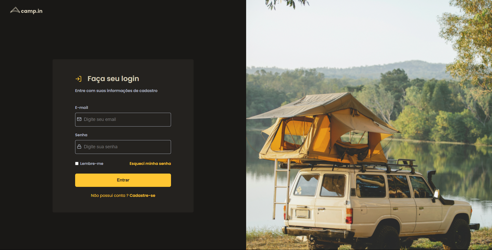
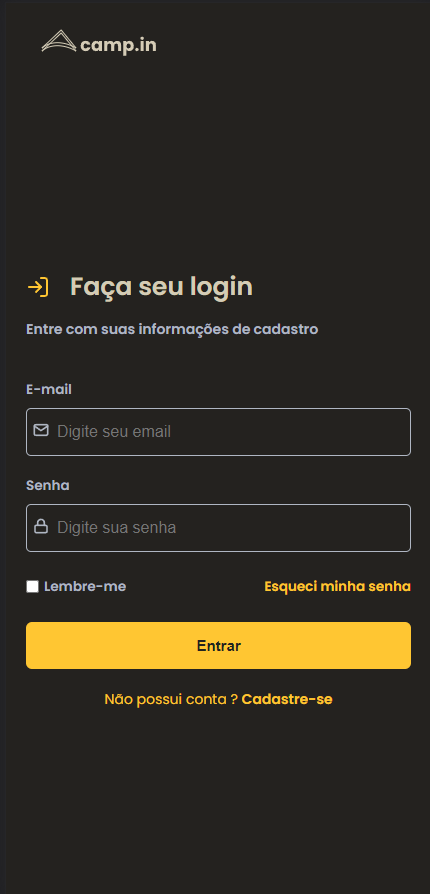

# Camp.in

<br />

## 💻 Sobre o projeto

Omnifood - é um website de uma empresa fictícia que proporciona planos de delivery baseados na dieta dos clientes.

<br />

## 🔥 Resultado

<p align="center">
  

  
</p>

<br/>

## :rocket: Tecnologias
- [HTML5](https://developer.mozilla.org/en-US/docs/Glossary/HTML5)
- [CSS3](https://developer.mozilla.org/pt-BR/docs/Web/CSS)

<br />

## 🤔 Como testar

O projeto esta hospedado no vercel: [Camp.in](https://camp-in-loginscreen.vercel.app)

Ou então, faça um clone :

```sh
  $ git clone https://github.com/lucasmsoares1/camp.in-loginscreen
```
